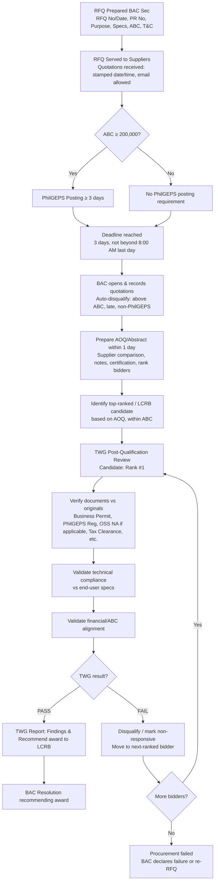
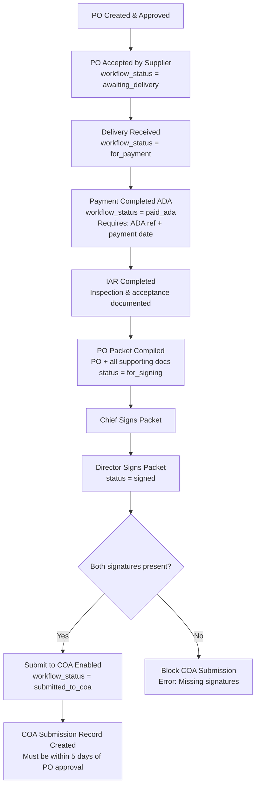

# DMW Procurement System — Complete Frontend UI Specification (v1.2)
**Updated:** February 11, 2026  
**Status:** Production-ready specification

This is the **authoritative, complete UI specification** for the DMW Caraga Procurement System frontend, incorporating:
- Document-driven RFQ/AOQ/BAC Resolution flows (aligned to actual templates)
- TWG Report-driven Post-Qualification with decision gates and looping
- Director + Chief signing gate before COA submission
- Updated business workflow statuses: **On Process → Awaiting Delivery → For Payment → Paid (ADA)**

---

## Table of Contents
1. [Technical Stack](#1-technical-stack)
2. [Navigation Structure](#2-navigation-structure)
3. [End-to-End Process Flow](#3-end-to-end-process-flow)
4. [Status Model](#4-status-model)
5. [Module Specifications](#5-module-specifications)
6. [RFQ → AOQ → Post-Qualification Flow (UPDATED)](#6-rfq--aoq--post-qualification-flow-updated)
7. [PO → Signing → COA Flow (UPDATED)](#7-po--signing--coa-flow-updated)
8. [Dashboard & Pipeline](#8-dashboard--pipeline)
9. [User Roles & Permissions](#9-user-roles--permissions)
10. [Required Modals](#10-required-modals)
11. [API Endpoints Summary](#11-api-endpoints-summary)
12. [Data Model Alignment](#12-data-model-alignment)

---

## 1) Technical Stack

### Architecture
- **Single Page Application (SPA)** using vanilla HTML + CSS + JavaScript (no frameworks)
- Hash-based or DOM-based routing (show/hide `<section class="page" id="...">` blocks)
- Client-side session management via localStorage or JWT tokens

### File Structure
```
/
├── index.html          # All pages, tables, modals, login screen
├── app.js             # Navigation, permissions, API calls, modal handlers, status transitions
└── main.css           # Design tokens, layout, component styles, badge variants
```

### Key Characteristics
- No build process required
- Responsive design (FlexBox/Grid)
- Icon library: Font Awesome 6.5.1
- Print-friendly document views for RFQ/AOQ/BAC Resolution/NOA

---

## 2) Navigation Structure

### Planning
- **Dashboard** — KPI summary, pipeline visualization, active cases
- **PPMP** — Project Procurement Management Plan (division-level)
- **APP** — Annual Procurement Plan (consolidated)

### Transactions
- **Purchase Requests (PR)** — Procurement initiation
- **RFQ** — Request for Quotation (issuance + receipt tracking)
- **Abstract of Quotation (AOQ)** — Quotation evaluation and ranking
- **Post-Qualification** — TWG verification and compliance review
- **BAC Resolution** — Award recommendation
- **Notice of Award (NOA)** — Winner notification
- **Purchase Orders (PO)** — Contract creation and acceptance tracking

### Inspection
- **IAR** — Inspection and Acceptance Report

### Signing & Submission (NEW)
- **PO Packet / Signing** — Supporting docs compilation + Chief/Director signatures
- **COA Submission** — Final submission to Commission on Audit

### Master Data
- **Items** — Procurement catalog
- **Suppliers** — Vendor directory
- **Users** — User management
- **Divisions** — DMW Caraga divisions (5)

### Reports
- **Reports** — PPMP summary, PR status, SVP lifecycle, timeline KPIs, PhilGEPS compliance, audit trail

---

## 3) End-to-End Process Flow

```
PPMP (Division Planning)
  ↓
APP (Consolidated Plan)
  ↓
PR (Purchase Request) → Approved
  ↓
RFQ Prepared & Sent (BAC Sec)
  ↓ [PhilGEPS posting if ABC ≥ 200k]
Quotations Received (stamped date/time; deadline: 3 days, 8:00 AM last day)
  ↓
AOQ Prepared (within 1 day of deadline) → Rank bidders, identify LCRB
  ↓
Post-Qualification (TWG)
  ├─ Verify docs vs originals (Business Permit, PhilGEPS Reg, OSS, etc.)
  ├─ Validate technical compliance vs end-user specs
  ├─ Validate financial/ABC alignment
  └─ TWG Result: PASS or FAIL
       ├─ PASS → BAC Resolution
       └─ FAIL → Move to next-ranked bidder (loop until responsive or declare failure)
  ↓
BAC Resolution Approved
  ↓
NOA Issued
  ↓
PO Created & Approved
  ↓
PO Accepted (supplier conforme) → workflow_status = "awaiting_delivery"
  ↓
Delivery Received → workflow_status = "for_payment"
  ↓
Payment Completed (ADA) → workflow_status = "paid_ada"
  ↓
IAR Completed (inspection/acceptance)
  ↓
PO Packet Compiled (PO + supporting docs)
  ↓
Chief Signs → Director Signs → workflow_status = "signed"
  ↓
Submit to COA (only if both signatures present)
```

---

## 4) Status Model

The system maintains two parallel status tracks:

### A) Document-level status (per module)
Used for internal workflow and approvals:

| Module | Status Values |
|--------|---------------|
| PR | `pending, approved, rejected, processed, cancelled` |
| RFQ | `draft, posted, closed, cancelled` |
| AOQ | `draft, submitted, approved, cancelled` |
| Post-Qual | `draft, in_progress, completed, failed, cancelled` |
| BAC Resolution | `draft, approved, rejected, cancelled` |
| NOA | `draft, issued, received, cancelled` |
| PO | `pending, approved, delivered, completed, cancelled` |
| IAR | `draft, completed, cancelled` |
| PO Packet | `draft, for_signing, signed, submitted_to_coa, cancelled` |
| COA Submission | `draft, submitted, received, returned, completed, cancelled` |

### B) Business workflow status (displayed in UI badges and Dashboard pipeline)
Primary status for case-level tracking:

| Status | Label | Badge Color | Trigger |
|--------|-------|-------------|---------|
| `pending` | Pending | Muted | Initial state |
| `on_process` | On Process | Info | PR approved + RFQ created/posted |
| `awaiting_delivery` | Awaiting Delivery | Warning | PO accepted (supplier conforme) |
| `for_payment` | For Payment | Warning | Delivery marked delivered OR IAR completed |
| `paid_ada` | Paid (ADA) | Success | Payment recorded with ADA reference + date |
| `for_signing` | For Signing | Info | PO packet compiled, awaiting signatures |
| `signed` | Signed | Success | Both Chief + Director signed |
| `submitted_to_coa` | COA Submitted | Success | COA submission record created |
| `cancelled` | Cancelled | Danger | Procurement cancelled |

### Status Badge Mapping (app.js)
```javascript
const WORKFLOW_STATUS_BADGES = {
  pending: { label: 'Pending', tone: 'muted' },
  on_process: { label: 'On Process', tone: 'info' },
  awaiting_delivery: { label: 'Awaiting Delivery', tone: 'warning' },
  for_payment: { label: 'For Payment', tone: 'warning' },
  paid_ada: { label: 'Paid (ADA)', tone: 'success' },
  for_signing: { label: 'For Signing', tone: 'info' },
  signed: { label: 'Signed', tone: 'success' },
  submitted_to_coa: { label: 'COA Submitted', tone: 'success' },
  cancelled: { label: 'Cancelled', tone: 'danger' }
};
```

---

## 5) Module Specifications

### 5.1) Purchase Requests (PR)
**Purpose:** Initiate procurement

**Key Fields:**
- PR Number (auto-generated: `PR-MON-YEAR-####`)
- Date, Purpose, Division, Requested By
- APP Reference (link to approved APP item)
- Estimated Amount
- Scheduled Activity Date
- Required attachments: Route Slip (Annex 1), Technical Specs/SOW/TOR

**Actions:**
- Create new PR
- Save as draft
- Submit for approval
- Approve/Return (HoPE/authorized approver)
- Create RFQ from approved PR

**Timeline requirement:** PR must be submitted at least 15 calendar days before the activity

---

### 5.2) RFQ (Request for Quotation)
**Purpose:** Solicit quotations from suppliers

**Key Fields:**
- RFQ Number
- Date Prepared
- PR Reference
- Purpose
- Item specifications (qty, unit, description, ABC)
- ABC Amount (total)
- Invited Suppliers (at least 3 for SVP)
- Submission Deadline
- PhilGEPS posting indicator (required if ABC ≥ 200,000)
- PhilGEPS posting dates (from/until, must be ≥ 3 calendar days)

**RFQ Terms & Conditions** (displayed and enforced):
1. Award shall be made on Per Item Basis/Lot/Package Total Quoted
2. Quotation validity shall not be less than 30 calendar days
3. Must be registered with PhilGEPS
4. Goods shall be delivered within one to three working days after the award has made
5. Place of delivery: 3rd Floor Esquina Dos Bldg., Cor. Doongan, Butuan City
6. **Term of Payment is Check (ADA)**
7. Liquidated Damages/Penalty: 1/10 of one percent for every day's of delay shall be imposed
8. In case of discrepancy between unit and total cost, unit cost shall prevail

**Receipt Tracking (NEW):**
Quotations may be received via:
- Physical submission (in duplicate)
- Email (dmw13.bac@gmail.com)

For each received quotation, record:
- Supplier name
- Received via (email/physical)
- **Received timestamp** (stamped date/time by BAC Secretariat) — REQUIRED
- Attachment(s) of quotation
- PhilGEPS registration status

**Validation Rules (hard-coded):**
- Quotation must be received **within 3 days from receipt** and **not beyond 8:00 AM of the last day**
- Block "Accept Quotation" if received beyond deadline
- **Bids higher than ABC are automatically disqualified**
- Supplier must be PhilGEPS-registered (per T&C #3)

**Actions:**
- Create/Edit RFQ
- Send RFQ to suppliers
- Mark as Posted (if PhilGEPS required)
- Accept received quotations (with timestamp validation)
- Print RFQ document

**Timeline:** RFQ must allow at least 3 days for quotation submission

---

### 5.3) Abstract of Quotation (AOQ)
**Purpose:** Open, record, and evaluate quotations; recommend preliminary awardee

**Document Structure (must match template):**
- AOQ Number
- Date Prepared
- RFQ Reference
- Purpose
- ABC Amount
- Supplier comparison table:
  - Columns: Supplier Name, Unit Price, Total Price, Remarks
  - For each item or total contract
- Notes/Conditions (e.g., "Duration: 11.5 months", "Billing: Monthly")
- Certification text: "We CERTIFY that we opened and recorded herein quotations received in respond to the RFQ."
- Recommendation text: "We therefore RECOMMEND to award to [SUPPLIER NAME] having submitted the most responsive quotation. We also certify that the lowest and responsive quotation recommended for this award is within the ABC."
- BAC Chairperson signature block

**Key Fields:**
- Abstract Number (auto-generated)
- Date Prepared (must be within 1 calendar day after RFQ deadline per SVP memo)
- RFQ Reference
- Supplier quotations (pulled from RFQ received quotations)
- Ranking logic:
  - Determine lowest calculated bid within ABC
  - Mark disqualified bidders with remarks (e.g., "Disqualified. No attachment of documents", "Above ABC")
- Preliminary LCRB (Lowest Calculated and Responsive Bidder)

**Actions:**
- Create Abstract (auto-populate from RFQ)
- Open & record quotations
- Rank bidders
- Mark recommended awardee
- Print Abstract
- Proceed to Post-Qualification

**Timeline:** Must be prepared within 1 calendar day after RFQ deadline

---

### 5.4) Post-Qualification (TWG Report-Driven) — UPDATED
**Purpose:** TWG verifies bidder compliance and responsiveness through document verification, technical validation, and financial review

**Process:**
Post-qualification is conducted by the Technical Working Group (TWG) for the purpose of determining compliance and responsiveness pursuant to IRR/RA 12009. It is a **verification stage after quotations** are opened.

**Key Sections (TWG Report Structure):**

#### A) Candidate Selection
- Auto-fill from AOQ: Current candidate = Rank #1 / LCRB
- If current candidate FAILS, button: "Move to Next-Ranked Bidder"
- Loop until a responsive bidder is found or procurement is declared failed

#### B) Document Verification (against originals)
TWG verifies submitted eligibility/supporting documents **against the original copies** and confirms they are true/faithful reproductions.

**Document Checklist Table:**
| Document | Status (PASS/FAIL/NA) | Verified Against Original | Attachment | Remarks |
|----------|----------------------|---------------------------|-----------|---------|
| Business/Mayor's Permit | ☐ PASS ☐ FAIL ☐ NA | ☐ Yes | Upload | |
| PhilGEPS Certificate of Registration | ☐ PASS ☐ FAIL ☐ NA | ☐ Yes | Upload | |
| Omnibus Sworn Statement | ☐ PASS ☐ FAIL ☐ NA | ☐ Yes | May be marked NA |
| Tax Clearance | ☐ PASS ☐ FAIL ☐ NA | ☐ Yes | May note "during payment" |
| Supplier Quotation | ☐ PASS ☐ FAIL ☐ NA | ☐ Yes | Upload | |
| Other Eligibility/Supporting Docs | ☐ PASS ☐ FAIL ☐ NA | ☐ Yes | Upload | |

#### C) Technical Compliance
Dedicated section: **"Compliance to the Technical Requirements of the End-User"**

- Technical specs compliance status: ☐ PASS ☐ FAIL
- End-user technical requirements reference (from PR/RFQ)
- TWG technical findings (textarea)

#### D) Financial/Price Validation
- Display ABC vs Quoted Price Summary (from AOQ)
- Mark if within ABC: ☐ Yes ☐ No
- Price reasonableness assessment (textarea)

#### E) TWG Findings & Recommendation
- **TWG Conclusion:** ☐ PASS ☐ FAIL
- Findings statement (textarea): "The bidder has/has not complied and is/is not responsive with all Legal, Technical, Financial and Post-Qualification requirements."
- Recommendation: ☐ Recommend award to BAC ☐ Disqualify and proceed to next bidder

**Key Fields:**
- Post-Qual Number (auto-generated)
- Date
- Abstract Reference
- Bidder Name (current candidate)
- Document verification results (JSONB)
- Technical compliance result
- Financial validation result
- Overall TWG result: **PASS** or **FAIL**
- TWG findings (text)
- TWG Report upload (required)
- Bidder supporting documents upload (multiple)

**Decision Gates (Critical):**
- If TWG result = **PASS** → Enable "Create BAC Resolution"
- If TWG result = **FAIL** → Mark bidder as non-responsive/disqualified, then allow TWG to run post-qualification for **next-ranked** quotation (loop)
- If no responsive bidders after all ranked quotations → BAC declares procurement failed or re-RFQ

**Actions:**
- Start Post-Qualification (for top-ranked bidder)
- Verify documents
- Record compliance results
- Submit TWG Report
- If FAIL: Move to next-ranked bidder
- If PASS: Create BAC Resolution

**Timeline:** Typically completed within 1-2 days after Abstract

---

### 5.5) BAC Resolution
**Purpose:** Official BAC recommendation for award to the LCRB

**Document Structure (must match template):**
- Resolution Number
- Date
- Title: "A RESOLUTION RECOMMENDING THE USE OF SMALL VALUE PROCUREMENT AND DECLARING THE LOWEST CALCULATED AND RESPONSIVE BIDDER FOR THE PROCUREMENT OF [ITEM/SERVICE]"
- Whereas clauses:
  - Reference to IRR/RA 12009 Section 26.1, 34
  - Procurement mode justification (SVP)
  - ABC amount
  - PhilGEPS posting requirement:
    - If ABC < 200,000: "procurement projects with ABCs of 200,000.00 and below are not subject to mandatory posting requirements"
    - If ABC ≥ 200,000: "the RFQ shall be posted for a period of three (3) calendar days on the PhilGEPS website" + posting dates
  - Number of bidders and evaluation results table
- Bidder evaluation table:
  - Columns: No., Name of Bidder, Total Bid Amount, Remarks
  - Remarks examples: "Complying/responsive/lowest calculated", "Above ABC", "Disqualified - No attach documents"
- Contract details table (ABC vs Contract Price)
- Resolution clauses:
  1. Recommend SVP mode
  2. Declare [SUPPLIER] as LCRB
- Signature blocks: BAC Chairperson, Vice-Chair, Members
- Approval block: HoPE (Head of Procuring Entity)

**Key Fields:**
- Resolution Number (auto-generated)
- Date
- Abstract Reference
- Post-Qualification Reference (if applicable)
- Procurement Mode (SVP/SVPDC/DC Shopping/Others)
- ABC Amount
- Recommended Supplier
- Recommended Awardee Name (text)
- Bid Amount
- PhilGEPS required (boolean)
- PhilGEPS posting dates (if required)
- Bidder evaluation data (from AOQ + Post-Qual)
- BAC Recommendation text
- Required attachments: BAC Resolution document, Post-Qual Report (optional), Abstract

**Actions:**
- Create BAC Resolution (only if Post-Qual PASS)
- Edit draft
- Print resolution
- Submit for HoPE approval
- Approve (HoPE)
- Issue NOA (after approval)

**Timeline:** Prepared and approved typically within 1 day after Post-Qualification completion

---

### 5.6) Notice of Award (NOA)
**Purpose:** Notify winning bidder of contract award

**Key Fields:**
- NOA Number (auto-generated)
- Date Issued (within 1 calendar day from BAC Resolution per SVP memo)
- BAC Resolution Reference
- Winning Bidder/Supplier
- Contract Amount
- Delivery Period
- Bidder Receipt Date
- Status: draft, issued, received, cancelled

**Actions:**
- Create NOA (from approved BAC Resolution)
- Print NOA
- Mark as Issued
- Mark Received by Bidder
- Create PO (after NOA issued)

**Timeline:** Issued by HoPE within 1 calendar day from BAC Resolution

---

### 5.7) Purchase Orders (PO) — UPDATED
**Purpose:** Formalize contract with supplier

**Key Fields:**
- PO Number (auto-generated)
- Date
- PR Reference
- NOA Reference
- Supplier
- Total Amount
- Expected Delivery Date
- Delivery Address
- Payment Terms

**Document status:**
- status: `pending, approved, delivered, completed, cancelled`

**Workflow status (NEW):**
- workflow_status: `pending, on_process, awaiting_delivery, for_payment, paid_ada, for_signing, signed, submitted_to_coa, cancelled`

**Acceptance tracking (NEW):**
- Accepted At (timestamp)
- Accepted By (user)
- Supplier Conforme Attachment (optional upload)

**Delivery tracking (NEW):**
- Delivered At (timestamp)
- Delivered By (user)
- Delivery Date

**Payment tracking (NEW):**
- Payment Status: `unpaid, for_payment, paid_ada`
- Payment Date
- ADA Reference Number

**Required attachments:**
- PO Document (required)
- Supplier Conforme (optional until signed)

**Actions:**
- Create PO (from NOA)
- Save as draft
- Approve PO (within 1 calendar day from NOA per SVP memo)
- **Mark PO Accepted** (NEW) → opens modal, sets workflow_status = `awaiting_delivery`
- **Mark Delivered** (NEW) → opens modal, sets workflow_status = `for_payment`
- **Mark Paid (ADA)** (NEW) → opens modal, requires ADA reference + payment date, sets workflow_status = `paid_ada`
- Print PO
- Create IAR (after delivery)

**Timeline:**
- PO approved within 1 calendar day from NOA
- Supplier signs within 7 calendar days from PO approval

---

### 5.8) IAR (Inspection and Acceptance Report)
**Purpose:** Document inspection and acceptance of delivered goods/services (Appendix 62 format)

**Key Fields:**
- IAR Number (auto-generated)
- PO Reference
- Supplier (readonly from PO)
- Invoice Number
- Delivery Receipt Number
- Date of Actual Delivery
- Inspection Date
- Inspection Result: `pending, accepted, rejected, partial`
- Findings/Remarks
- Inspected By
- Date Inspected
- Received By
- Date Received

**Required attachments:**
- IAR Document (Appendix 62) — required
- Supplier Invoice — required
- Delivery Receipt — required
- Photos — optional, multiple

**Signatories:**
- Inspection Officer
- Property Custodian

**Actions:**
- Create IAR (from delivered PO)
- Record inspection results
- Upload documents
- Complete IAR
- Print IAR

**Timeline:** Typically completed within 1-2 days after delivery

---

### 5.9) PO Packet / Signing — NEW MODULE
**Purpose:** Compile supporting documents and obtain Chief + Director signatures before COA submission

This is a **mandatory gate** introduced in the updated process. COA submission cannot proceed without both signatures.

**Key Fields:**
- PO Reference (unique, one packet per PO)
- Status: `draft, for_signing, signed, submitted_to_coa, cancelled`
- Compiled At (timestamp)
- Compiled By (user)
- Chief Signed At (timestamp)
- Chief Signed By (user)
- Director Signed At (timestamp)
- Director Signed By (user)
- Packet Attachment (optional merged/scanned PDF of all docs)
- Remarks

**Supporting Documents Checklist:**
Display attached documents from the transaction:
- ☐ Purchase Request (PR)
- ☐ Request for Quotation (RFQ)
- ☐ Abstract of Quotation (AOQ)
- ☐ Post-Qualification Report (if applicable)
- ☐ BAC Resolution
- ☐ Notice of Award (NOA)
- ☐ Purchase Order (PO)
- ☐ Supplier Conforme
- ☐ Inspection and Acceptance Report (IAR)
- ☐ Delivery Receipt
- ☐ Supplier Invoice
- ☐ Other supporting documents

**Actions:**
- **Compile Packet** → creates packet record, sets status = `for_signing`, optional upload merged PDF
- **Mark Chief Signed** → requires date/time, optional upload signed page, records chief_signed_at
- **Mark Director Signed** → requires date/time, optional upload signed page, records director_signed_at
- When both signed → packet status = `signed`, enables "Submit to COA"
- View packet details
- Print checklist

**Business Rules:**
- Only Supply Officer or BAC Secretariat can compile packet
- Only designated Chief role can mark Chief Signed
- Only designated Director (HoPE) can mark Director Signed
- COA submission button is **disabled** until both signatures are recorded

**Timeline:** PO with complete attachments must be submitted to COA on or before 5 calendar days from date of approval (per SVP memo)

---

### 5.10) COA Submission
**Purpose:** Submit procurement packet to Commission on Audit

**Prerequisites (enforced):**
- PO Packet must exist
- PO Packet status must be `signed` (both Chief + Director signed)

**Key Fields:**
- Submission Number (auto-generated)
- PO Reference
- IAR Reference
- PO Packet Reference
- Submission Date
- Received by COA (person name)
- COA Receipt Date
- Status: `draft, submitted, received, returned, completed, cancelled`
- Documents Included (JSONB checklist)
- COA Packet Attachment (optional if already in PO Packet)

**Actions:**
- **Submit to COA** (only enabled if packet is signed)
- Mark as Received by COA
- Print checklist
- View packet

**Timeline:** Must be submitted within 5 calendar days from PO approval

---

## 6) RFQ → AOQ → Post-Qualification Flow (UPDATED)



### Key Rules (Enforced in UI):
1. **RFQ Receipt:**
   - Accept quotations via email or physical (duplicate copies)
   - Record stamped date/time for each received quotation
   - Validate deadline: within 3 days from receipt, not beyond 8:00 AM last day
   - Auto-disqualify bids above ABC
   - Require PhilGEPS registration per T&C

2. **AOQ Preparation:**
   - Must be completed within 1 calendar day after RFQ deadline
   - Rank bidders: lowest calculated bid within ABC = preliminary LCRB
   - Mark disqualified bidders with specific remarks

3. **Post-Qualification (TWG):**
   - Conducted for top-ranked bidder first
   - Document verification against originals (checklist required)
   - Technical compliance validation (dedicated section)
   - Financial/ABC validation
   - TWG result: PASS or FAIL

4. **Decision Gates:**
   - PASS → proceed to BAC Resolution
   - FAIL → move to next-ranked bidder, repeat post-qualification
   - No responsive bidders → declare failure or re-RFQ

---

## 7) PO → Signing → COA Flow (UPDATED)



### Key Rules (Enforced in UI):
1. **PO Acceptance:**
   - Captures date/time and optional supplier conforme upload
   - Sets workflow_status = `awaiting_delivery`

2. **Delivery:**
   - Captures delivery date
   - Sets workflow_status = `for_payment`

3. **Payment (ADA):**
   - Requires payment date AND ADA reference number (both mandatory)
   - Sets workflow_status = `paid_ada`

4. **PO Packet Compilation:**
   - Creates packet record linked to PO
   - Displays checklist of all required documents
   - Optional upload of merged packet PDF
   - Sets packet status = `for_signing`

5. **Signing Gate:**
   - Chief must sign first OR Director first (order not enforced, but both required)
   - Each signature records timestamp + user
   - Optional upload of signed page attachment
   - Only when both `chief_signed_at` AND `director_signed_at` are present → packet status = `signed`

6. **COA Submission:**
   - UI must check packet status = `signed` before enabling Submit button
   - If not signed, show error: "Cannot submit to COA. Packet requires Chief and Director signatures."
   - Submission creates COA record and sets workflow_status = `submitted_to_coa`

---

## 8) Dashboard & Pipeline

### KPI Summary Cards
- **PPMP Items Count** — Total items in division PPMPs
- **APP Projects Count** — Total projects in consolidated APP
- **Active Cases Count** — Ongoing procurement transactions
- **COA Submitted Count** — Cases submitted to COA

### Transaction Pipeline (UPDATED)
Visual workflow showing counts at each stage:

1. Draft PR
2. PR For Approval
3. PR Approved
4. RFQ Posted/Sent
5. Quotations Received
6. AOQ Prepared
7. Post-Qual (TWG Review)
8. BAC Resolution Approved
9. NOA Issued
10. PO Approved
11. **On Process** (case-level workflow status)
12. **Awaiting Delivery** (PO accepted)
13. **For Payment** (delivered)
14. **Paid (ADA)** (payment completed)
15. IAR Completed
16. **For Signing** (packet compiled)
17. **Signed** (Chief + Director signed)
18. COA Submitted

Each stage shows count + color indicator (on track / at risk)

### SLA Targets Banner
- PR Approval: 5 days
- RFQ: 3 days
- Abstract: 1 day
- NOA: 1 day
- PO Approval: 1 day
- Supplier Sign: 7 days
- COA: 5 days

### Active Cases Table
Shows current procurement cases with:
- Case Number (PR Number)
- Project/Purpose
- Division
- Mode (SVP/DC)
- Current Status (workflow_status badge)
- Timeline Compliance (on track / at risk)
- Actions (View Details)

### PPMP Status by Division
Progress bars showing PPMP completion percentage for each of the 5 divisions:
- FAD (Finance and Administrative Division)
- WRSD (Welfare Reintegration Services Division)
- MWPSD (Migrant Workers Protection Services Division)
- MWPTD (Migrant Workers Protection Training Division)
- ORD (Office of the Regional Director)

---

## 9) User Roles & Permissions

### Available Roles
1. **admin** — System Administrator (full access)
2. **hope** — Regional Director / Head of Procuring Entity (approvals)
3. **bac_chair** — BAC Chairperson (approve abstracts, resolutions)
4. **bac_secretariat** — BAC Secretary (create RFQ, AOQ, manage quotations)
5. **twg_member** — Technical Working Group Member (post-qualification)
6. **division_head** — Division Head (approve division PPMP, approve PRs)
7. **end_user** — End User (create PPMP, create PR)
8. **supply_officer** — Supply/Procurement Officer (create PO, compile packets)
9. **inspector** — Inspection/Property Custodian (create IAR)
10. **auditor** — Auditor (view-only access, audit trail)

### Permission Matrix

| Role | PPMP | APP | PR | RFQ | AOQ | Post-Qual | BAC Res | NOA | PO | IAR | Packet | COA |
|------|------|-----|----|----|-----|-----------|---------|-----|----|----|--------|-----|
| admin | Full | Full | Full | Full | Full | Full | Full | Full | Full | Full | Full | Full |
| hope | Approve | Approve | Approve | View | View | View | Approve | Approve | Approve | View | Sign (Director) | View |
| bac_chair | View | View | View | View | Approve | View | Approve | View | View | View | - | - |
| bac_secretariat | View | Consolidate | View | Create | Create | - | Create | Create | - | View | - | Submit |
| twg_member | View | View | View | View | View | Create/Complete | - | - | - | - | - | - |
| division_head | Approve | View | Approve | - | - | - | - | - | - | - | - | - |
| end_user | Create | - | Create | - | - | - | - | - | - | - | - | - |
| supply_officer | View | View | View | Create | Create | - | Create | Create | Create | View | Compile | Submit |
| inspector | - | - | - | - | - | - | - | - | View | Create | - | - |
| auditor | View | View | View | View | View | View | View | View | View | View | View | View |

### Chief Role (NEW)
- Assign "Chief" signing permission to specific user(s) in User Management
- Chief can mark "Chief Signed" on PO Packets
- Typically: Chief Admin, Chief Procurement, or Division Chief (per office policy)

---

## 10) Required Modals

### 10.1) RFQ Modals
- **Create RFQ Modal** — Link to PR, add items, invite suppliers
- **Accept Quotation Modal** — Record received timestamp, upload quotation, verify PhilGEPS registration

### 10.2) AOQ Modals
- **Create Abstract Modal** — Link to RFQ, auto-populate quotations, rank bidders
- **Bidder Remarks Modal** — Add/edit remarks (e.g., "Above ABC", "Disqualified - No attachments")

### 10.3) Post-Qualification Modals
- **Start Post-Qual Modal** — Select candidate (auto-fill from AOQ rank)
- **Document Verification Modal** — Checklist per document, verify against original, upload scanned copies
- **Technical Compliance Modal** — Record compliance result, findings
- **TWG Findings Modal** — Overall PASS/FAIL, recommendation text

### 10.4) PO Modals (NEW)
- **Accept PO Modal**
  - Fields: `accepted_at` (required), `supplier_conforme_attachment` (optional)
  - Action: Set workflow_status = `awaiting_delivery`

- **Mark Delivered Modal**
  - Fields: `delivered_at` (required), `delivery_date` (required)
  - Action: Set workflow_status = `for_payment`

- **Mark Paid (ADA) Modal**
  - Fields: `payment_date` (required), `ada_reference_no` (required)
  - Action: Set workflow_status = `paid_ada`

### 10.5) PO Packet Modals (NEW)
- **Compile Packet Modal**
  - Display checklist of required docs
  - Optional: upload merged/scanned PDF
  - Action: Create packet record, set status = `for_signing`

- **Chief Sign Modal**
  - Fields: `chief_signed_at` (required), `signed_page_attachment` (optional)
  - Action: Record chief signature

- **Director Sign Modal**
  - Fields: `director_signed_at` (required), `signed_page_attachment` (optional)
  - Action: Record director signature, if both signed → status = `signed`

### 10.6) COA Submission Modal
- **Submit to COA Modal**
  - Validate: packet status = `signed` (both signatures present)
  - Fields: `submission_date`, `received_by_coa` (optional), `coa_packet_attachment` (optional)
  - Action: Create COA submission record, set workflow_status = `submitted_to_coa`

---

## 11) API Endpoints Summary

### Authentication
- `POST /api/auth/login` — Validate credentials, return JWT token
- `POST /api/auth/logout` — Invalidate token, clear session
- `GET /api/auth/verify` — Validate token validity

### Dashboard
- `GET /api/dashboard/stats` — KPI summary (PPMP items, APP projects, active cases, COA submitted)
- `GET /api/dashboard/pipeline-status` — Transaction pipeline counts by stage
- `GET /api/dashboard/active-cases` — List of current procurement cases

### PPMP & APP
- `GET /api/ppmp` — List PPMPs (filter by division, year, mode)
- `POST /api/ppmp` — Create PPMP
- `PUT /api/ppmp/:id` — Update PPMP
- `POST /api/ppmp/:id/submit-to-app` — Submit PPMP to APP
- `GET /api/app` — List APPs (filter by year, version)
- `POST /api/app/consolidate` — Consolidate from PPMPs

### Purchase Requests
- `GET /api/purchase-requests` — List PRs (filter by status, division)
- `POST /api/purchase-requests` — Create PR
- `PUT /api/purchase-requests/:id` — Update PR
- `POST /api/purchase-requests/:id/submit` — Submit for approval
- `POST /api/purchase-requests/:id/approve` — Approve PR
- `POST /api/purchase-requests/:id/return` — Return PR with remarks

### RFQ
- `GET /api/rfqs` — List RFQs
- `POST /api/rfqs` — Create RFQ
- `PUT /api/rfqs/:id` — Update RFQ
- `POST /api/rfqs/:id/send` — Send RFQ to suppliers
- `POST /api/rfqs/:id/accept-quotation` — Accept received quotation (with timestamp)
- `GET /api/rfqs/:id/quotations` — List received quotations

### Abstract of Quotation
- `GET /api/abstracts` — List abstracts
- `POST /api/abstracts` — Create abstract (from RFQ)
- `PUT /api/abstracts/:id` — Update abstract
- `POST /api/abstracts/:id/rank-bidders` — Rank bidders, identify LCRB
- `GET /api/abstracts/:id/print` — Print abstract document

### Post-Qualification
- `GET /api/post-qualifications` — List post-qual records
- `POST /api/post-qualifications` — Start post-qual (for candidate)
- `PUT /api/post-qualifications/:id` — Update post-qual
- `POST /api/post-qualifications/:id/verify-document` — Record document verification
- `POST /api/post-qualifications/:id/submit-twg-report` — Submit TWG findings + result
- `POST /api/post-qualifications/:id/move-to-next-bidder` — Move to next-ranked (if FAIL)

### BAC Resolution
- `GET /api/bac-resolutions` — List resolutions
- `POST /api/bac-resolutions` — Create resolution (from post-qual PASS)
- `PUT /api/bac-resolutions/:id` — Update resolution
- `POST /api/bac-resolutions/:id/approve` — Approve resolution (HoPE)
- `GET /api/bac-resolutions/:id/print` — Print resolution document

### NOA
- `GET /api/noas` — List NOAs
- `POST /api/noas` — Create NOA (from BAC resolution)
- `PUT /api/noas/:id` — Update NOA
- `PUT /api/noas/:id/mark-received` — Mark received by bidder
- `GET /api/noas/:id/print` — Print NOA document

### Purchase Orders
- `GET /api/purchase-orders` — List POs
- `POST /api/purchase-orders` — Create PO (from NOA)
- `PUT /api/purchase-orders/:id` — Update PO
- `POST /api/purchase-orders/:id/approve` — Approve PO
- **`PUT /api/purchase-orders/:id/accept`** — Mark PO accepted (NEW)
- **`PUT /api/purchase-orders/:id/deliver`** — Mark delivered (NEW)
- **`PUT /api/purchase-orders/:id/pay-ada`** — Mark paid via ADA (NEW)
- `GET /api/purchase-orders/:id/print` — Print PO document

### IAR
- `GET /api/iars` — List IARs
- `POST /api/iars` — Create IAR (from delivered PO)
- `PUT /api/iars/:id` — Update IAR
- `POST /api/iars/:id/complete` — Complete IAR
- `GET /api/iars/:id/print` — Print IAR document

### PO Packet / Signing (NEW)
- `GET /api/po-packets` — List packets (filter by status)
- `POST /api/po-packets` — Create packet (compile)
- `POST /api/po-packets/:id/chief-sign` — Record Chief signature
- `POST /api/po-packets/:id/director-sign` — Record Director signature
- `GET /api/po-packets/:id/checklist` — Get supporting docs checklist

### COA Submission
- `GET /api/coa-submissions` — List COA submissions
- `POST /api/coa-submissions` — Create submission (validate packet signed)
- `PUT /api/coa-submissions/:id` — Update submission
- `PUT /api/coa-submissions/:id/mark-received` — Mark received by COA
- `GET /api/coa-submissions/:id/checklist` — Print checklist

### Attachments
- `POST /api/attachments/upload` — Upload file, return attachment ID
- `GET /api/attachments/:id` — Download file
- `DELETE /api/attachments/:id` — Delete file

### Master Data
- `GET /api/items` — List items
- `POST /api/items` — Create item
- `PUT /api/items/:id` — Update item
- `DELETE /api/items/:id` — Delete item
- `GET /api/suppliers` — List suppliers
- `POST /api/suppliers` — Create supplier
- `PUT /api/suppliers/:id` — Update supplier
- `DELETE /api/suppliers/:id` — Delete supplier
- `GET /api/users` — List users
- `POST /api/users` — Create user
- `PUT /api/users/:id` — Update user
- `DELETE /api/users/:id` — Delete user
- `GET /api/divisions` — List divisions

### Reports
- `GET /api/reports/ppmp-summary` — PPMP summary by division
- `GET /api/reports/pr-status` — PR status report
- `GET /api/reports/svp-lifecycle` — Transaction status from PR to COA
- `GET /api/reports/timeline-kpi` — Timeline KPI compliance
- `GET /api/reports/philgeps-compliance` — PhilGEPS compliance (ABC ≥ 200k)
- `GET /api/reports/coa-submission` — COA submission tracking
- `GET /api/reports/audit-trail` — System activity logs

---

## 12) Data Model Alignment

This UI specification is designed to work with the updated database schema:

### File
- `schema_updated_v1_1.sql`

### Key Tables
- `departments` — 5 DMW Caraga divisions
- `users` — Expanded roles (admin, hope, bac_chair, bac_secretariat, twg_member, etc.)
- `attachments` + `entity_attachments` — Generic file storage + linking
- `items` — Procurement catalog
- `suppliers` — Vendor directory
- `procurementplans` + `plan_items` — PPMP/APP
- `purchaserequests` + `pr_items` — Purchase requests
- `rfqs` + `rfq_items` + `rfq_suppliers` — Request for quotation
- `abstracts` + `abstract_quotations` + `abstract_quote_items` — Abstract of quotation
- `post_qualifications` — TWG post-qualification
- `bac_resolutions` — BAC award recommendations
- `notices_of_award` — Notice of award
- `purchaseorders` + `po_items` — Purchase orders
  - Includes `workflow_status` field (NEW)
  - Includes acceptance, delivery, and payment tracking fields (NEW)
- `iars` — Inspection and acceptance report
- `po_packets` — PO packet compilation + signing (NEW)
- `coa_submissions` — COA submission (NEW)
- `audit_log` — System audit trail

### Workflow Status Field
The `purchaseorders` table includes:
- `status` (document-level: pending, approved, delivered, completed, cancelled)
- **`workflow_status`** (business-level: pending, on_process, awaiting_delivery, for_payment, paid_ada, for_signing, signed, submitted_to_coa, cancelled) — NEW

This allows parallel tracking of document state and overall case workflow state.

---

## Implementation Notes

### For Frontend Developers
1. All document-driven modules (RFQ, AOQ, BAC Resolution, NOA) must support print/export matching the provided templates
2. Validation rules (deadline, ABC limits, PhilGEPS registration) must be enforced client-side AND server-side
3. Status badges must use the `WORKFLOW_STATUS_BADGES` mapping consistently across all pages
4. Modal forms must include proper validation and error handling
5. File uploads must support multiple files where specified and validate file types/sizes

### For Backend Developers
1. Implement business rule validation in API endpoints (e.g., block COA submission if packet not signed)
2. Use database transactions for multi-table operations (e.g., create packet + update PO workflow_status)
3. Maintain audit trail for all create/update/delete operations
4. Implement proper role-based access control (RBAC) matching the permission matrix
5. Generate auto-incrementing document numbers per module (PR, RFQ, AOQ, etc.)

### For QA/Testing
1. Test the complete RFQ → AOQ → Post-Qual flow with PASS and FAIL scenarios
2. Test the TWG looping behavior (move to next bidder on FAIL)
3. Test the signing gate: COA submission must be blocked without both signatures
4. Test workflow status transitions at each stage
5. Test role permissions: ensure users can only access/modify allowed modules
6. Test deadline validations (RFQ receipt, AOQ preparation timelines)
7. Test PhilGEPS posting logic (ABC threshold behavior)

---

## Revision History

| Version | Date | Changes |
|---------|------|---------|
| 1.0 | Jan 2026 | Initial specification |
| 1.1 | Feb 10, 2026 | Added Director/Chief signing gate, updated workflow statuses |
| 1.2 | Feb 11, 2026 | Updated RFQ → AOQ → Post-Qual flow with TWG Report structure, added decision gates, enforced RFQ receipt rules, added payment tracking (ADA) |

---

**END OF SPECIFICATION**
